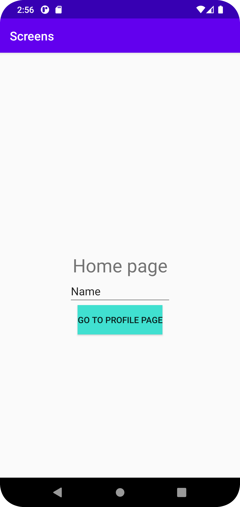
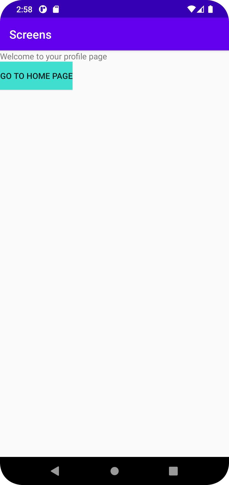

# Rapport

Jag började med att skapa en till aktivitet. Sedan la jag till event i MainActivity och skapade en layout för "homepage", som finns i xml-filen
activity_main. I layouten la jag till en knapp som går till en annan sida, denna har jag valt att kalla "profile page". 
Denna "profile page" består av en xml-fil som heter acitivity_main2 som jag skapat och stylat, där jag även lagt in en knapp som går tillbaka till 
föregående sida, alltså "home page". 
Jag använde mig av intent för att koppla ihop dessa två sidor. 


Java kod från Home page, där man bland annat kan se hur intent använts. 
```
   profile.setOnClickListener(new View.OnClickListener() {
            @Override
            public void onClick(View view) {
                Log.d("==>", "Go to profile page button pressed.");
                Log.d("==>", "Username:"+username.getText().toString());
                Intent intent = new Intent(MainActivity.this, MainActivity2.class);
                intent.putExtra("username", username.getText().toString());
                startActivity(intent);

            }
        });
```

Java kod från Profile page, där man bland annat kan se hur intent använts.
```
 
        Intent intent = getIntent();
        Bundle extras = intent.getExtras();

        String username = extras.getString("username");
        Log.d("==>", "Username from intent" +username);

        homepage.setOnClickListener(new View.OnClickListener() {
            @Override
            public void onClick(View view) {
                Log.d("==>", "Go to home page pressed.");
                finish();
            }
        });
```

Bild på home page



Bild på profile page 



Läs gärna:

- Boulos, M.N.K., Warren, J., Gong, J. & Yue, P. (2010) Web GIS in practice VIII: HTML5 and the canvas element for interactive online mapping. International journal of health geographics 9, 14. Shin, Y. &
- Wunsche, B.C. (2013) A smartphone-based golf simulation exercise game for supporting arthritis patients. 2013 28th International Conference of Image and Vision Computing New Zealand (IVCNZ), IEEE, pp. 459–464.
- Wohlin, C., Runeson, P., Höst, M., Ohlsson, M.C., Regnell, B., Wesslén, A. (2012) Experimentation in Software Engineering, Berlin, Heidelberg: Springer Berlin Heidelberg.
